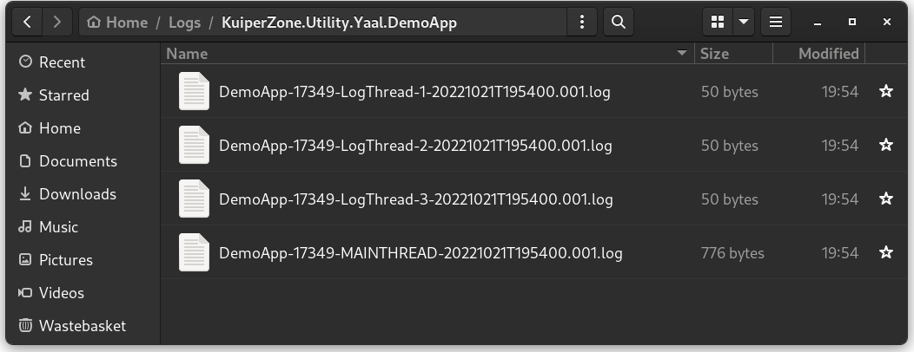

# yaal - An RFC 5424 Logger for .NET #

**Yaal** is *yet another application logger* for .NET. On Linux, it writes to syslog in [RFC 5424](https://www.rfc-editor.org/rfc/rfc5424) format by default and, on Windows, to EventLog. It supports other sinks and formats, including a file logger with rotation and auto-removal.

**[NUGET PACKAGE TBD](https://www.nuget.org/packages/KuiperZone.Utility.Yaal/1.0.0)**

Yaal is licensed under It is licensed as **GPL-3.0-or-later**. It has been tested on Linux and Windows, but not on other platforms.

## Features ##
Features include:

* Local syslog by default in [RFC 5424](https://www.rfc-editor.org/rfc/rfc5424) format on Linux
* Support for RFC 5424 structured data
* EventLog on Windows
* Supports [BSD RFC 3164](https://www.rfc-editor.org/rfc/rfc3164) format
* Log severity levels and a threshold setting
* Writes stack trace information in DEBUG build
* Supports file logging, with file rotation and old file removal
* Each thread can have own log file
* Other sinks available to write to Console and a in-memory buffer

## Getting Started ##

Install the nuget package. See also the DemoApp application in the source code, as it provides examples
of how to use many of the features of the Yaal `Logger` class.

Once installed, simply:

    using KuiperZone.Utility.Yaal;
    ...
    Logger.Global.Write($"Hello world");

Or for debug:

    Logger.Global.Debug($"Value: {value} = 0x{value:X8}");

These two examples, out of the box, will write to syslog on Linux and EventLog on Windows. It is possible to change these "log sinks" or add new ones.

The latter example, above, writes to the log only in a DEBUG build (it is omitted in RELEASE).
Moreover, on Linux, it writes in RFC 5424 format with stack trace as *structured data*:

    <15>1 2022-10-21T19:54:42.754408+01:00 vendetta DemoApp 17709 - [DGB@00000000 FUNC="KuiperZone.Utility.Yaal.DemoApp.Program.CallingMethod(Int32 value)" LINE="109" SEVERITY="debug" THREAD="17709-MAINTHREAD"] Value: 668 = 0x0000029C

Here, the calling method is recorded as the SD-PARAM "FUNC" and "LINE". Note that "THREAD" gives: "{pid}-{thread name or id}".
This allows debug output to filtered on the application PID and calling thread. Hint: [KSystemLog](https://apps.kde.org/en-gb/ksystemlog/)
makes a good syslog viewer on Linux, even under Gnome.

On Windows, the same code above writes to EventLog:

In writing to EventLog, the message `SeverityLevel` value is translated to a matching `EventLogEntryType` value.
By default, the LogName used is "Application" and Source is ".NET Runtime". This combination allows for messages to be
written out of the box, without having to register the event source.

The fact that the use of custom "Source" [requires their registration in Administrator mode](https://www.jitbit.com/alexblog/266-writing-to-an-event-log-from-net-without-the-description-for-event-id-nonsense/)
may prove a PITA on Windows. Therefore, the `FileSink` may be considered as an alternative (see below).

### Thread Safety ###

The Yaal `Logger` class is thread-safe, and the `Logger.Global` instance can be used by any thread.
Other instances of `Logger` can be created, however.

### Logging Severity and Threshold ###

Every log message has an associated `SeverityLevel` value which follows the RFC 5424 specification. Namely, in
order of decreasing priority: Emergency, Alert, Critical, Error, Warning, Notice, Info, Debug. If unspecified,
the default message severity is `SeverityLevel.Info`.

Now, the `Logger` class has a "threshold" setting: `Logger.Threshold`, such that only messages with a priority equal or
higher than this are written (those with a lower priority are ignored). The default value is `SeverityLevel.Debug`.
This setting can be changed at any time, providing a way to restrict messages to high priorities or
disable logging entirely.

Example:

    Logger.Global.Threshold = SeverityLevel.Error;

Additionally, we can disable all logging as follows:

    Logger.Global.Threshold = SeverityLevel.Disabled;

## The FileSink ###

Yaal supports the concept of "sinks", such that multiple sinks can be added to a `Logger` instance.
It is best to add sinks at application start-up (although it can be done at any time).

To add a file sink:

    Logger.Global.AddSink(new FileSink());

The logger will now write to both Syslog (or EventLog), and files. The default file output directory is located under the user's home. By default, each thread writes to a separate file:

Wherever logging is written using `Logger.Debug()`, the caller method and line information is prefxed to the output as follows:

Sink specific options can be specified at the time of its creation. Here, for example, we can auto remove old log
files after 30 days:

    var opts = new FileSinkOptions();
    opts.StaleLife = TimeSpan.FromDays(30);
    Logger.Global.AddSink(new FileSink(opts));

The logging directory and filename can also be specified. Moreover, a number of placeholder variables can be used which
are expanded at the time the file is opened.

Including the "{THD}" (thread name) placeholder in the filename will cause the sink to create a different file for each calling thread:

    var opts = new FileSinkOptions();
    opts.DirectoryPattern = "{DOCDIR}/Logs/{ASM}";
    opts.FilePattern = "{APP}-{PID}-{THD}-{[yyyyMMddTHHmmss]}.{PAG}.log";

    Logger.Global.AddSink(new FileSink(opts));

The above will cause a logging directory to be created under the user home directory. Each log file will be named
after the application, PID, thread name (or ID), date-time, and a "page" counter. If "{THD}" is omitted, logging
output from different threads will be written to the same file.

## More Sinks ##

### ConsoleSink ###

To add a Console sink:

    Logger.Global.AddSink(new ConsoleSink());

By default, output is colored according to severity.

### BufferSink ###

The `BufferSink` merely holds recent log messages in memory. Its only purpose is to offer a way to query recent
logging and may be useful in testing.

    Logger.Global.AddSink(new BufferSink());

    Logger.Global.log.Debug("This is logged in DEBUG only");
    bool logged = buffer.Contains("logged in DEBUG only");

    Console.WriteLine($"Statement was logged: {logged}");

## RFC 5424 Structured Data ##

The `LogMessage` class can be used to write RFC 5424 structured data.

    var msg = new LogMessage(SeverityLevel.Notice, "Contains structured data");

    msg.Data.Add("exampleSDID@32473", new SdElement());
    msg.Data["exampleSDID@32473"].Add("iut", "9");
    msg.Data["exampleSDID@32473"].Add("eventSource", "rawr");
    msg.Data["exampleSDID@32473"].Add("eventID", "123");

    Logger.Global.Write(msg);

This logs the following:

    <13>1 2022-10-22T00:27:32.073321+01:00 vendetta DemoApp 35328 - [exampleSDID@32473 eventID="123" eventSource="rawr" iut="9"] Contains structured data

## More Information ##

### Custom Options ###

It is possible to specify a number of custom option values. This should be done at application start up,
prior to logging.

    var opts = new LogOptions();
    opts.AppName = "CustomAppName";
    opts.DebugId = "DBG@32473";
    opts.Priority = PriorityKind.Omit;

    Logger.Global.Options = opts;

### BSD RFC 3164 Format ###

Do this at application start up:

    Logger.Global.Sinks = new ILogSink[] { new SyslogSink(new SyslogSinkOptions(LogFormat.Bsd)) }

This replaces the default sink(s) with a new syslog one, only this one is configured to write in the BSD format.

### Approach to Internal Errors ###

As a rule, the `Logger` class does not throw exceptions. However, in the event of a failure to log output,
the `Logger.Error` property may prove useful in diagnosing the problem.

## Copyright & License ##

Copyright (C) Andy Thomas, 2022.
Website: https://kuiper.zone

Yaal Logger is free software: you can redistribute it and/or modify it under the terms of
the GNU General Public License as published by the Free Software Foundation, either version 3 of the License, or
(at your option) any later version.

Yaal is distributed in the hope that it will be useful, but WITHOUT ANY WARRANTY; without even the implied
warranty of MERCHANTABILITY or FITNESS FOR A PARTICULAR PURPOSE. See the GNU General Public License for more details.

## Other Projects ###

Other KuiperZone projects:

**Avant Garde** is cross-platform XAML previewer for the C# Avalonia Framework. It was the first Avalonia preview solution for Linux.
[github.com/kuiperzone/AvantGarde](https://github.com/kuiperzone/AvantGarde)

**Publish-AppImage for .NET** is a simple bash script deployment utility which calls dotnet publish and packages the output as an AppImage file (or zip) with a single command.
[github.com/kuiperzone/Publish-AppImage](https://github.com/kuiperzone/Publish-AppImage)
